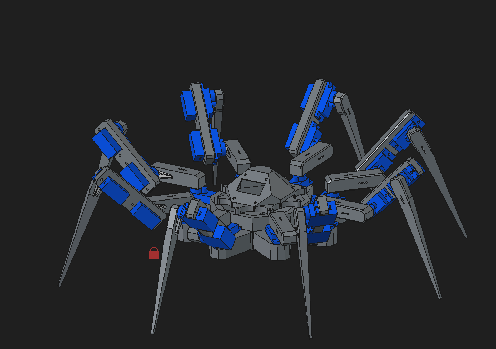

# Toxopid

>Octapod robot controlled via companion application.

---

# Components

1) MCU - [RaspberryPi pico 2 wh](https://www.gme.cz/v/1517388/raspberry-pico-2-wh)
2) Servo (24) - [MG90S](https://dratek.cz/arduino-platforma/180244-servomotor-sg90-360-kontinualni.html)
3) Display - [OLED displej 0,96"](https://www.gme.cz/v/1509095/oled-displej-096-128x64-i2c-bily)
4) Servo module [24-channel](https://www.gme.cz/v/1508859/modul-24-kanalovy-budic-servo-motoru)
5) Battery [GNB 1100mAh 2S](https://www.rotorama.cz/product/gnb-1100mah-2s-60c-hv)
6) Step-down convertor (2) [XL4005](https://www.laskakit.cz/step-down-menic-s-xl4005/)
7) Battery management module [INA226](https://www.laskakit.cz/en/laskakit-ina226-sensor-pro-mereni-napeti--proudu-a-vykonu/?utm_source=google&utm_medium=cpc&utm_campaign=1_PLA_All_ROAS_%5BCZ%5D_tROAS_600%2F500&utm_id=1371265813&gad_source=1&gad_campaignid=1371265813&gclid=Cj0KCQjwjvfSBhDpARIsAEiOpSs9bXrcziMqKSFc_kehHI5NE-KQwwm7ethIOrnqCYQYKv3224JOIwAaAtVEEALw_wcB)

---

# Physical attributes

## Legs

>Each leg consists of 3 parts: Coxa, Femur and Tibia

$$
Coxa \approx 5,81 cm^3
$$

$$
Femur \approx 4,75cm^3
$$

$$
Tibia \approx 3,44cm^3
$$

>From this I calculated weight for each leg.

$$
Leg = (Coxa + Femur + Tibia) \cdot MaterialDensity + 3 \cdot Servo
$$

>Servo motors used weight $13g$ and I used `PLA` as my material for parts that means:

$$
Leg \approx 57,2g
$$

$$
AllLegs \approx 457,5g
$$

Leg lengths:

| Coxa  | 5cm  |
| ----- | ---- |
| Femur | 8cm  |
| Tibia | 11cm |

---

## Electronic components

>Weight of each electrical component used.

$$
Battery \approx 46g
$$

$$
StepDownConvertor \approx 66g
$$

$$
ServoModule \approx 60g
$$

$$
MCU = 6g
$$

$$
Display = 3g
$$

>Electrical components (without servos) weight around: $247g$.

---

## Summary of Physical attributes

$$
LowerTorso \approx 157g
$$

$$RoofTorso \approx 22,5g$$

$$Leg \approx 8 \cdot 58g$$

$$
ElectricalParts \approx 247g
$$

---

$$
\text{Weight of the model} \approx 321,75g
$$

$$
\text{Total weight} \approx 881g
$$

---
